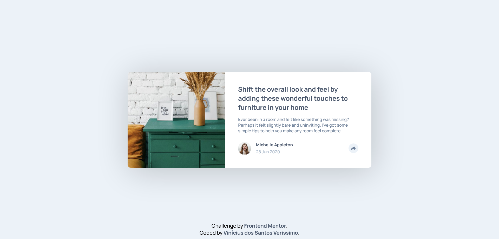

# Frontend Mentor - Article preview solution

## Overview

### Screenshot

### Links

- Solution URL: Working on it.

## My process

### Built with

- Semantic HTML5 markup
- CSS custom properties
- Flexbox
- JavaScript

### What I learned

I learned how to use JavaScript to add event listeners to buttons and toggle the display of a specific element of the DOM.

## Author

- GitHub - Vinícius dos Santos Verissimo (https://github.com/viniciusdsv93)
